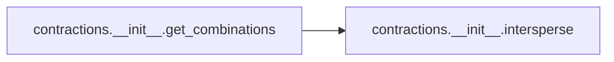

# Contractions Init

[_Documentation generated by Documatic_](https://www.documatic.com)

<!---Documatic-section-Codebase Structure-start--->
## Codebase Structure

<!---Documatic-block-system_architecture-start--->
```mermaid
None
```
<!---Documatic-block-system_architecture-end--->

# #
<!---Documatic-section-Codebase Structure-end--->

<!---Documatic-section-contractions.__init__.get_combinations-start--->
## contractions.__init__.get_combinations

<!---Documatic-section-get_combinations-start--->


### Object Calls

* contractions.__init__.intersperse

<!---Documatic-block-contractions.__init__.get_combinations-start--->
<details>
	<summary><code>contractions.__init__.get_combinations</code> code snippet</summary>

```python
def get_combinations(tokens, joiners):
    combs = []
    combs.append(tokens)
    results = []
    for option in combs:
        option = [[x] for x in option]
        option = intersperse(option, joiners)
        for c in product(*option):
            results.append(''.join(c))
    return results
```
</details>
<!---Documatic-block-contractions.__init__.get_combinations-end--->
<!---Documatic-section-get_combinations-end--->

# #
<!---Documatic-section-contractions.__init__.get_combinations-end--->

<!---Documatic-section-contractions.__init__.intersperse-start--->
## contractions.__init__.intersperse

<!---Documatic-section-intersperse-start--->
<!---Documatic-block-contractions.__init__.intersperse-start--->
<details>
	<summary><code>contractions.__init__.intersperse</code> code snippet</summary>

```python
def intersperse(lst, item):
    result = [item] * (len(lst) * 2 - 1)
    result[0::2] = lst
    return result
```
</details>
<!---Documatic-block-contractions.__init__.intersperse-end--->
<!---Documatic-section-intersperse-end--->

# #
<!---Documatic-section-contractions.__init__.intersperse-end--->

<!---Documatic-section-contractions.__init__.fix-start--->
## contractions.__init__.fix

<!---Documatic-section-fix-start--->
<!---Documatic-block-contractions.__init__.fix-start--->
<details>
	<summary><code>contractions.__init__.fix</code> code snippet</summary>

```python
def fix(s, leftovers=True, slang=True):
    ts = replacers[leftovers, slang]
    return ts.replace(s)
```
</details>
<!---Documatic-block-contractions.__init__.fix-end--->
<!---Documatic-section-fix-end--->

# #
<!---Documatic-section-contractions.__init__.fix-end--->

<!---Documatic-section-contractions.__init__.add-start--->
## contractions.__init__.add

<!---Documatic-section-add-start--->
<!---Documatic-block-contractions.__init__.add-start--->
<details>
	<summary><code>contractions.__init__.add</code> code snippet</summary>

```python
def add(key, value):
    for ts in replacers.values():
        ts.add(key, value)
```
</details>
<!---Documatic-block-contractions.__init__.add-end--->
<!---Documatic-section-add-end--->

# #
<!---Documatic-section-contractions.__init__.add-end--->

<!---Documatic-section-contractions.__init__.preview-start--->
## contractions.__init__.preview

<!---Documatic-section-preview-start--->
<!---Documatic-block-contractions.__init__.preview-start--->
<details>
	<summary><code>contractions.__init__.preview</code> code snippet</summary>

```python
def preview(text, flank):
    try:
        int(flank)
    except Exception as e:
        print(e)
        raise Exception('Argument flank must be integer!')
    ts = ts_view_window
    results = ts.findall(text)
    preview_items = []
    for result in results:
        window_start = result.start - flank
        window_end = result.end + flank
        if window_start < 0:
            window_start = 0
        if window_end > len(text):
            window_end = len(text)
        preview_items.append({'match': result.match, 'start': result.start, 'end': result.end, 'viewing_window': text[window_start:window_end]})
    return preview_items
```
</details>
<!---Documatic-block-contractions.__init__.preview-end--->
<!---Documatic-section-preview-end--->

# #
<!---Documatic-section-contractions.__init__.preview-end--->

[_Documentation generated by Documatic_](https://www.documatic.com)